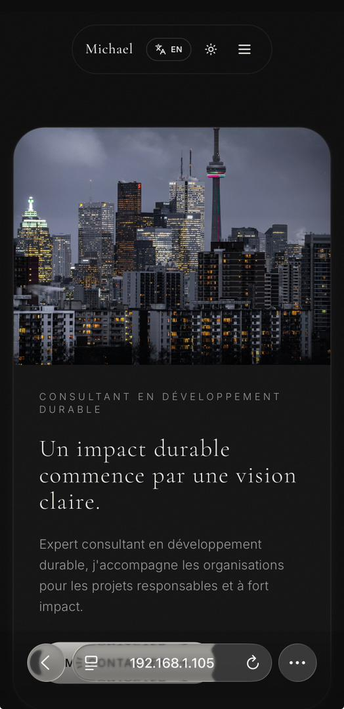

# Michael Portfolio



Portfolio personnel et blog orienté impact durable, avec une partie vitrine (réalisations) et une partie éditoriale (posts Supabase).

## Objectif du projet

Ce projet présente :
- les réalisations et piliers de travail de Michael,
- un blog dynamique connecté à Supabase,
- un espace admin pour publier et supprimer des articles.

## Stack technique

- React + TypeScript
- Vite
- Tailwind CSS
- Supabase (Auth, PostgreSQL, Storage)
- Framer Motion

## Fonctionnalités clés

- Section "Réalisations" avec contenu détaillé (intro, sections, conclusion, tags)
- Blog dynamique avec pagination
- Page article via slug (`/article/:slug`)
- Publication d'article avec upload d'image dans le bucket `ARTICLE`
- Génération automatique de `slug` et `excerpt`
- Suppression d'article avec logs de diagnostic
- Internationalisation via context (FR/EN)

## Structure (résumé)

- `src/pages` : routes
- `src/features/blog` : logique blog
- `src/features/projects` : réalisations statiques
- `src/context` : language provider/hooks
- `src/lib/supabase.ts` : client et services Supabase
- `src/types/supabase.ts` : types DB

## Installation locale

```bash
npm install
npm run dev
```

## Build production

```bash
npm run build
npm run preview
```

## Variables d'environnement

Crée un fichier `.env` avec :

```env
VITE_SUPABASE_URL=...
VITE_SUPABASE_PUBLISHABLE_KEY=...
```

## Notes Supabase

- Table principale blog : `public.posts`
- Bucket images : `ARTICLE` (sensible à la casse)
- RLS activé

## Auteur

Criss Kasisa (crisskasisa1@gmail.com)
